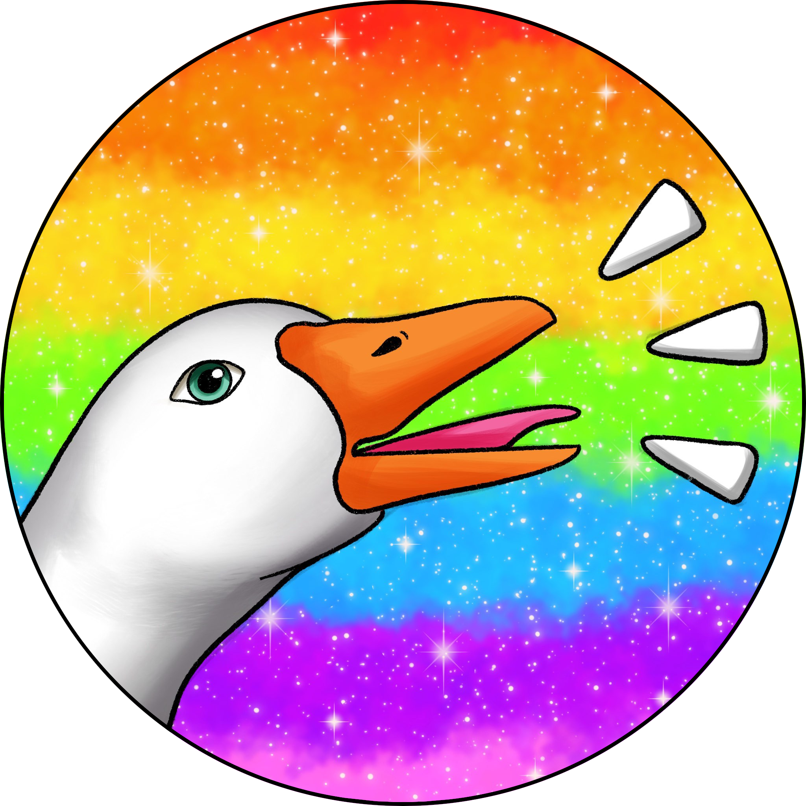

# gagl
_gagl_ (like "gaggle") is an in-progress toolkit for people with dissociative identity disorder (DID) or other specified dissociative disorder 1 (OSDD-1a/b).

### Tools
- Discord bot
- Web dashboard (yes, it will work on mobile too)
- RESTful API (so it can be used by many other services)

## Getting involved
You don't have to know any code to contribute to this project!
You can talk to us on [Discord](https://discord.gg/MPVKh4P95m) or [Matrix](https://matrix.to/#/!oFczzPeAwxVwWBQhoj:matrix.org?via=matrix.org), or by raising an issue [here](https://github.com/weareknot/gagl/issues/new/choose).   

### Ideas
Especially since this project is so new, we're always looking for ideas. Tell us what you would find useful!

### Art and Design
Developers (or maybe just me?) are often told that we're not actually very good at making things look pretty. If you _are_ good at making things look pretty, either by designing interfaces or by drawing us some wonderful pictures of chaotic geese, we need your help!

### Writing
There isn't a huge amount to write about at the moment, but eventually we're going to need documentation and guides that actually make sense to people who don't spend all day thinking about code. We also might need people to write bot messages and things like that.

### Code
If you know Python, excellent. If you know HTML, SCSS/CSS, and/or JavaScript (particularly Vue), brilliant. If you've got no idea what I'm talking about, _but_ you would love to try and learn some code and contribute anyway, that is also wonderful. If you join our Discord, we have a role for _baby devs_, and the more experienced devs on the team will help you as much as they can.

## Development setup
You need:
- [Docker](https://docs.docker.com/engine/install) and [Docker Compose](https://docs.docker.com/compose/install)

1. Change the `.env.template` file to `.env` and edit the values to whatever you want.
```sh
NEO4J_USER=yourusername
NEO4J_PASS=yourpassword
```

2. Run `docker-compose up -d` in the project root.
